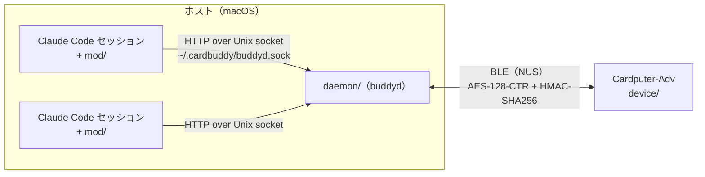

# Cardputer CLI Buddy

[English](README.md) | 日本語


M5Stack Cardputer-Adv から、BLE 経由で複数の Claude Code CLI セッションを操作する。

- 権限ダイアログに allow / deny で答える（allow は全文を表示できたときだけ）
- AskUserQuestion に答える
- プロンプトを送る
- セッションログを読む
- かなで入力する（Tab で 英数 / ひらがな / カタカナ を切り替える）
- 内蔵マイクで、日本語か英語のプロンプトを音声入力する（文字起こしは Mac 上でオンデバイスで行う）

## 構成



| ディレクトリ | 役割 |
| --- | --- |
| `mod/` | Claude Code の plugin。function hooks がセッションの登録、AskUserQuestion の中継、プロンプトの投入、セッションログの送信を行う。同梱の `PermissionRequest` コマンド hook が、端末のダイアログと並行してデバイスの回答を待つ。 |
| `daemon/` | buddyd（Python、bleak）。Unix socket `~/.cardbuddy/buddyd.sock` で mod と話し、BLE でデバイスとつなぐ。CLI `buddy`（`pair` / `status` / `install-agent`）を含む。 |
| `device/` | Cardputer-Adv 用の MicroPython アプリ。[moremas/build-with-claude](https://github.com/moremas/build-with-claude) の buddy（Apache-2.0）を改変したもの。 |
| `PROTOCOL.md` | buddyd とデバイスの間の通信仕様と脅威モデル。 |
| `docs/daemon-api.md` | mod と buddyd の間の HTTP API。 |
| `testvectors/` | 暗号層のテストベクタ。daemon と device の両方のテストで使う。 |

## 必要なもの

- M5Stack Cardputer-Adv
- macOS（`buddy install-agent` は launchd 用。buddyd 自体は bleak が動く環境なら動く）
- Python 3.10 以上と [uv](https://docs.astral.sh/uv/)
- Claude Code
- 音声入力を使う場合は、macOS 26 以上と Swift 6.2 以上（Xcode か Command Line Tools）

## セットアップ

以下のコマンドは、リポジトリのルートで実行する。シリアルポートは環境ごとに異なる（macOS では `/dev/cu.usbmodem*`）。

### 1. ファームウェアを書き込む

UIFlow2 の **v2.4.2** を書き込む。それより新しい版は使わない。

- v2.4.3 以降（ESP-IDF 5.5 系）には、Cardputer-Adv のマイクが無音になる回帰がある（[m5stack/uiflow-micropython#97](https://github.com/m5stack/uiflow-micropython/pull/97)、[espressif/esp-idf#18621](https://github.com/espressif/esp-idf/issues/18621)）。
- M5Burner で「UIFlow2.0 Cardputer-Adv」を選び、版に 2.4.2 を指定して書き込む。
- Cardputer-Adv は USB ネイティブのため、ダウンロードモードへはボタンでしか入れない。背面の BtnG0 を押したまま BtnRST を押して離し、その後 BtnG0 を離す。

v2.4.2 は、通常起動時の USB を TinyUSB CDC として出す。リセット後にシリアルポートが戻ってこない場合は、USB ケーブルを挿し直す。

### 2. デバイスにアプリを入れる

```sh
uv --directory daemon run python ../device/scripts/deploy.py --port /dev/cu.usbmodemXXXX
```

`device/scripts/deploy.py` は次のことを行う。

1. 大きいモジュール（`crypto`、`buddy_protocol`、`buddy_ble`、`buddy_ui_cp`、`kana`）を mpy-cross で `.mpy` にする。デバイスの空きメモリは約 60KB しかなく、`.py` のままでは import 時のコンパイルでメモリが足りなくなるため。
2. `.mpy` と、`.py` のまま入れるファイル（`main.py`、`apps/*.py` など）を `/flash/` に書き込む。
3. デバイス上の同名の `.py` を消す。MicroPython は `.mpy` より `.py` を優先して import するため。
4. NVS の `uiflow.boot_option` を 2 にする。起動時に UIFlow のランチャーではなく `/flash/main.py` が動くようになる。
5. デバイスを再起動する。

mpy-cross の版は、デバイスの MicroPython に合わせる必要がある。UIFlow2 v2.4.2 は MicroPython 1.25（mpy v6.3）なので、既定値の `--mpy-cross 1.25` のままでよい。mpy-cross は `uvx` で取得する。`--port` を省くと、コンパイルだけを行って結果を表示する。

### 3. 鍵を共有する（`buddy pair`）

```sh
uv --directory daemon run buddy pair --port /dev/cu.usbmodemXXXX
```

- 32 byte の鍵を作り、ホストの `~/.cardbuddy/key`（0600）と、デバイスの `/flash/cardbuddy.key` に USB 経由で書き込む。鍵は BLE には流さない。
- デバイスの広告名（`Claude_` + BT MAC の下位 6 桁）を `~/.cardbuddy/device` に保存する。buddyd はこの名前に完全一致で接続する。
- 既存の鍵があればそれを使う。作り直すときは `--rotate` を付ける。
- 書き込んだら、デバイスをリセットして鍵を読み込ませる。

### 4. buddyd を起動する

手元で動かす場合は次のとおり。

```sh
uv --directory daemon run buddyd
```

ログイン時に自動で起動させる場合は、launchd の LaunchAgent を登録する。

```sh
uv --directory daemon run buddy install-agent
launchctl bootstrap gui/$(id -u) ~/Library/LaunchAgents/com.sohsatoh.cardbuddy.buddyd.plist
```

- ログは `~/.cardbuddy/buddyd.log` に出る。
- 状態は `uv --directory daemon run buddy status` で確認できる。
- 鍵を作り直したときは、buddyd を再起動する（`launchctl kickstart -k gui/$(id -u)/com.sohsatoh.cardbuddy.buddyd`）。
- 初回は、macOS が Bluetooth の利用許可を求めることがある。

### 5. Claude Code に mod を読み込ませる

起動ごとに指定する場合は次のとおり。

```sh
claude --plugin-dir /path/to/cardputer-cli-buddy/mod
```

常に読み込ませる場合は、settings の `env` に `CLAUDE_CODE_PLUGIN_DIRS` を設定する。

```json
{
  "env": {
    "CLAUDE_CODE_PLUGIN_DIRS": "/path/to/cardputer-cli-buddy/mod"
  }
}
```

buddyd に登録されたセッションには番号（1〜9）が付き、端末のステータスラインに `Buddy #n` と出る。デバイスの一覧の番号と一致する。

### 6. デバイスでアプリを起動する

デバイスは起動するとランチャー（`main.py`）を表示する。`;` / `.`（または `,` / `/`、`W` / `S`）で `claude_buddy` を選び、Enter で起動する。アプリを `Q` で終えるとデバイスが再起動し、ランチャーに戻る。

### 7. 音声入力の文字起こしを用意する

buddyd は、デバイスで録音した音声を `daemon/stt/stt` で文字起こしする。macOS 26 の SpeechTranscriber をオンデバイスで使うため、音声は Mac の外に出ない。

```sh
make -C daemon/stt
```

- `swiftc` が PATH に無い場合は、`make -C daemon/stt SWIFTC=/path/to/swiftc` のように指定する。
- 言語（日本語 `ja-JP` / 英語 `en-US`）ごとの音声認識モデルは、初回の文字起こしのときに macOS がダウンロードする。ネットワークが必要で、数秒〜数十秒かかる（英語で約 12 秒だった）。初回の待ちを避けるには、先に次のコマンドでダウンロードしておく。

  ```sh
  daemon/stt/stt --lang ja-JP --prepare
  daemon/stt/stt --lang en-US --prepare
  ```

- 許可ダイアログは出ない。SpeechTranscriber は、システム設定の「音声認識」の許可も「音声入力」（Dictation）の設定も使わない（macOS 26.5 で確認）。
- モデルのダウンロード後は、60 秒までの音声を 1〜2 秒程度で文字起こしする（Apple Silicon で確認）。

## キー操作

Cardputer-Adv の矢印キーは、単体で押すと `;` `,` `.` `/` の文字になる。以下の「↑↓」は、単体の `;` `.` と Fn+↑↓ のどちらでもよい。Esc は `` ` `` の位置のキーである。

| 画面 | 操作 |
| --- | --- |
| 一覧 | `1`〜`9` / ↑↓ で選択、Enter で入力、`l` か Fn+→ でログ、`v` で音声入力、`Q` で終了 |
| ログ | ↑↓ でスクロール（上端で古いページを読み込む）、`r` で再読み込み、Enter で入力、Esc で一覧へ |
| perm | `Y` で allow、`N` で deny、内容が長いときは ↑↓ でスクロール |
| ask | `1`〜`4` / ↑↓ で選択、Space で複数選択のトグル、Enter で確定 |
| 入力 | 下表 |
| 音声入力 | Enter か Space で録音の開始と停止、Tab で日本語 / 英語の切り替え（録音していないとき）、Esc で取り消し |

入力画面のキーは次のとおり。

| キー | 動作 |
| --- | --- |
| Fn+← / Fn+→ | カーソルを左右に動かす |
| Fn+↑ / Fn+↓ | カーソルを上下の行に動かす |
| Del | カーソルの前の 1 文字を消す（未確定のローマ字があれば、それを先に消す） |
| Enter | 送信する |
| Esc | 取り消して元の画面に戻る |
| Tab | 英数 / ひらがな / カタカナ を切り替える |

- 入力画面では、単体の `;` `,` `.` `/` は文字として入る。
- かなはローマ字で入力する。漢字への変換はしない。未確定のローマ字は水色の下線付きで表示し、Enter・矢印・Tab を押す前に確定する。
- Tab は `+` と同じキーコードで届くため、`+` は入力できない。
- プロンプトは最大 500 文字。
- 音声入力は最大 60 秒。文字起こしの結果は入力画面に入るので、確認・編集してから Enter で送る。自動では送らない。
- perm は、全文を表示できないとき（`full` が false のとき）は「全文が長すぎます：端末で確認」と出し、`N` だけを受け付ける。
- perm / ask が届いてから 400 ms の間は、確定キー（`Y` / `N` / Enter）を受け付けない。一覧を操作していた指で誤って答えないようにするため。
- 入力中に perm / ask が届いても、入力画面はそのまま残り、件数だけを表示する。Esc で戻ると回答できる。

## セキュリティ

詳細と脅威モデルは [PROTOCOL.md](PROTOCOL.md) を参照。要点は次のとおり。

- BLE の上に、アプリ層の暗号化を重ねる。AES-128-CTR と HMAC-SHA256（Encrypt-then-MAC）を使い、接続ごとに HKDF-SHA256 でセッション鍵を導出する。過去の接続で録ったフレームを再送しても、MAC の検証で落ちる。
- 共有鍵は USB 経由で書き込み、BLE には流さない。
- デバイスは、perm の全文を表示できたときだけ allow を送る。
- 次のものは守らない。
  - DoS（第三者の central が先につなぐ、電波妨害など）
  - トラフィック解析
  - 鍵の保護（ホストとデバイスに平文で保存する）
  - 同じユーザー権限で動くプロセス（Unix socket は 0600 で、同じユーザーは信頼する）

## テスト

daemon、device、mod の Python のテストは、次のコマンドでまとめて実行する。device のテストは、M5 の API の偽物を使ってホスト上で動く。`stt` の実バイナリを使うテストは、`make -C daemon/stt` でビルドしてあるときだけ動く。

```sh
uv --directory daemon run pytest -q tests stt ../device/tests ../mod/tests
```

mod の TypeScript のテストは、次のコマンドで実行する。

```sh
claude plugin test mod
```

## 制限事項

- 表示できるセッションは 9 件まで。10 件目以降は、空きができるまで番号が付かず、デバイスに出ない。
- 計画の承認（ExitPlanMode）はデバイスでは扱わず、端末で行う。
- AskUserQuestion は、選択肢が 2〜4 個の問いだけをデバイスに送る。それ以外は端末で答える。
- buddyd がデバイスとつながっていないときや、セッションに番号が無いときは、権限ダイアログは端末だけに出る。
- 漢字変換はできない。
- UIFlow2 は v2.4.2 に固定する（「ファームウェアを書き込む」を参照）。
- ランチャーは起動時に、upstream から引き継いだ `device/wifi_event.py` の Wi-Fi（SSID `cardputer`）への接続を試みる。不要なら、このファイルの SSID とパスワードを書き換えるか、デバイスから削除する。

## ライセンス

[Apache License 2.0](LICENSE)。著作権表示と帰属は [NOTICE](NOTICE) を参照。

`device/` は [moremas/build-with-claude](https://github.com/moremas/build-with-claude)（Apache-2.0）の buddy を改変したもの。upstream の著作権表示と改変内容は [device/NOTICE](device/NOTICE) と [device/LICENSE-THIRD-PARTY.md](device/LICENSE-THIRD-PARTY.md) を参照。
