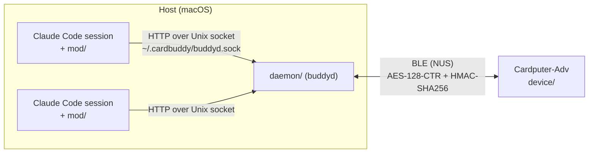

# Cardputer CLI Buddy

English | [日本語](README.ja.md)

Drive multiple Claude Code CLI sessions from an M5Stack Cardputer-Adv over BLE.

- Answer permission dialogs with allow / deny (allow is only offered when the full request fits on screen)
- Answer AskUserQuestion prompts
- Send prompts
- Read session logs
- Type in Japanese kana (Tab cycles between alphanumeric / hiragana / katakana)

## Architecture



| Directory | Role |
| --- | --- |
| `mod/` | Claude Code plugin. Its function hooks register the session, relay AskUserQuestion, inject prompts, and forward the session log. A bundled `PermissionRequest` command hook waits for the device's answer alongside the terminal dialog. |
| `daemon/` | buddyd (Python, bleak). Talks to the mod over the Unix socket `~/.cardbuddy/buddyd.sock` and to the device over BLE. Includes the `buddy` CLI (`pair` / `status` / `install-agent`). |
| `device/` | MicroPython app for the Cardputer-Adv, a modified version of the buddy from [moremas/build-with-claude](https://github.com/moremas/build-with-claude) (Apache-2.0). |
| `PROTOCOL.md` | Wire protocol between buddyd and the device, and the threat model (Japanese). |
| `docs/daemon-api.md` | HTTP API between the mod and buddyd (Japanese). |
| `testvectors/` | Test vectors for the crypto layer, shared by the daemon and device tests. |

## Requirements

- M5Stack Cardputer-Adv
- macOS (`buddy install-agent` targets launchd; buddyd itself runs anywhere bleak does)
- Python 3.10+ and [uv](https://docs.astral.sh/uv/)
- Claude Code

## Setup

Run the commands below from the repository root. The serial port name depends on your machine (`/dev/cu.usbmodem*` on macOS).

### 1. Flash the firmware

Flash UIFlow2 **v2.4.2**. Do not use a newer release.

- v2.4.3 and later (ESP-IDF 5.5) have a regression that leaves the Cardputer-Adv microphone silent ([m5stack/uiflow-micropython#97](https://github.com/m5stack/uiflow-micropython/pull/97), [espressif/esp-idf#18621](https://github.com/espressif/esp-idf/issues/18621)).
- In M5Burner, pick "UIFlow2.0 Cardputer-Adv" and select version 2.4.2.
- The Cardputer-Adv uses native USB, so download mode can only be entered with the buttons: hold BtnG0 on the back, press and release BtnRST, then release BtnG0.

On v2.4.2, the USB port shows up as a TinyUSB CDC device during normal boot. If the serial port does not come back after a reset, unplug and replug the USB cable.

### 2. Install the app on the device

```sh
uv --directory daemon run python ../device/scripts/deploy.py --port /dev/cu.usbmodemXXXX
```

`device/scripts/deploy.py` does the following:

1. Compiles the large modules (`crypto`, `buddy_protocol`, `buddy_ble`, `buddy_ui_cp`, `kana`) to `.mpy` with mpy-cross. The device has only about 60 KB of free memory, which is not enough to compile them from `.py` at import time.
2. Writes the `.mpy` files and the files that stay as `.py` (`main.py`, `apps/*.py`, and so on) to `/flash/`.
3. Removes any `.py` file on the device with the same name as a `.mpy`, because MicroPython imports `.py` in preference to `.mpy`.
4. Sets the NVS key `uiflow.boot_option` to 2, so the device boots into `/flash/main.py` instead of the UIFlow launcher.
5. Reboots the device.

The mpy-cross version must match the device's MicroPython. UIFlow2 v2.4.2 ships MicroPython 1.25 (mpy v6.3), which is the default `--mpy-cross 1.25`. mpy-cross is fetched with `uvx`. Without `--port`, the script only compiles and prints the result.

### 3. Share the key (`buddy pair`)

```sh
uv --directory daemon run buddy pair --port /dev/cu.usbmodemXXXX
```

- Generates a 32-byte key and writes it over USB to `~/.cardbuddy/key` (mode 0600) on the host and `/flash/cardbuddy.key` on the device. The key never goes over BLE.
- Saves the device's advertised name (`Claude_` followed by the last 6 hex digits of its BT MAC) to `~/.cardbuddy/device`. buddyd connects only to a device with exactly this name.
- Reuses the existing key if there is one. Pass `--rotate` to generate a new key.
- Reset the device afterwards so it loads the key.

### 4. Start buddyd

To run it in the foreground:

```sh
uv --directory daemon run buddyd
```

To start it automatically at login, register a launchd LaunchAgent:

```sh
uv --directory daemon run buddy install-agent
launchctl bootstrap gui/$(id -u) ~/Library/LaunchAgents/com.sohsatoh.cardbuddy.buddyd.plist
```

- Logs go to `~/.cardbuddy/buddyd.log`.
- Check the status with `uv --directory daemon run buddy status`.
- After rotating the key, restart buddyd (`launchctl kickstart -k gui/$(id -u)/com.sohsatoh.cardbuddy.buddyd`).
- On first run, macOS may ask for permission to use Bluetooth.

### 5. Load the mod into Claude Code

Per invocation:

```sh
claude --plugin-dir /path/to/cardputer-cli-buddy/mod
```

To load it every time, set `CLAUDE_CODE_PLUGIN_DIRS` under `env` in your settings:

```json
{
  "env": {
    "CLAUDE_CODE_PLUGIN_DIRS": "/path/to/cardputer-cli-buddy/mod"
  }
}
```

Each session registered with buddyd gets a number from 1 to 9, shown as `Buddy #n` in the terminal status line. It matches the number in the device's session list.

### 6. Launch the app on the device

The device boots into a launcher (`main.py`). Select `claude_buddy` with `;` / `.` (or `,` / `/`, or `W` / `S`) and press Enter. Quitting the app with `Q` reboots the device back into the launcher.

## Keys

Pressed on their own, the Cardputer-Adv arrow keys type `;` `,` `.` `/`. Below, "↑↓" means either the bare `;` `.` keys or Fn+↑↓. Esc is the `` ` `` key.

| Screen | Keys |
| --- | --- |
| Session list | `1`–`9` / ↑↓ select, Enter compose a prompt, `l` or Fn+→ open the log, `Q` quit |
| Log | ↑↓ scroll (older pages load at the top), `r` reload, Enter compose a prompt, Esc back to the list |
| Permission | `Y` allow, `N` deny, ↑↓ scroll long requests |
| Question | `1`–`4` / ↑↓ select, Space toggle (multi-select), Enter confirm |
| Prompt input | See below |

Prompt input keys:

| Key | Action |
| --- | --- |
| Fn+← / Fn+→ | Move the cursor left / right |
| Fn+↑ / Fn+↓ | Move the cursor up / down a line |
| Del | Delete the character before the cursor (pending romaji is deleted first) |
| Enter | Send |
| Esc | Cancel and go back |
| Tab | Cycle alphanumeric / hiragana / katakana |

- In the input screen, the bare `;` `,` `.` `/` keys type those characters.
- Kana are typed as romaji. There is no kanji conversion. Pending romaji is shown underlined in cyan and is committed before Enter, an arrow key, or Tab takes effect.
- Tab arrives with the same key code as `+`, so `+` cannot be typed.
- Prompts are limited to 500 characters.
- When a permission request does not fit on screen in full (`full` is false), the device shows a warning to check the terminal and accepts only `N`.
- For 400 ms after a permission request or question appears, the confirming keys (`Y` / `N` / Enter) are ignored, so a keypress meant for the session list cannot answer it by accident.
- If a permission request or question arrives while you are typing, the input screen stays and shows the number of pending requests. Press Esc to go back and answer.

## Security

See [PROTOCOL.md](PROTOCOL.md) (Japanese) for the details and the threat model. In short:

- An application-layer encryption sits on top of BLE: AES-128-CTR with HMAC-SHA256 (encrypt-then-MAC), with per-connection session keys derived by HKDF-SHA256. Frames recorded from an earlier connection fail MAC verification when replayed.
- The shared key is written over USB and never sent over BLE.
- The device sends allow only for permission requests it could display in full.
- Out of scope:
  - Denial of service (a third-party central connecting first, jamming, and so on)
  - Traffic analysis
  - Key protection (the key is stored in plaintext on the host and the device)
  - Other processes running as the same user (the Unix socket is mode 0600, and the same user is trusted)

## Tests

Run the Python tests for the daemon, device, and mod together. The device tests run on the host against a fake M5 API.

```sh
uv --directory daemon run pytest -q tests ../device/tests ../mod/tests
```

Run the mod's TypeScript tests with:

```sh
claude plugin test mod
```

## Limitations

- At most 9 sessions are shown. Further sessions get no number and stay off the device until a slot frees up.
- Plan approval (ExitPlanMode) is not handled on the device; approve plans in the terminal.
- Only questions with 2 to 4 options are sent to the device. Others must be answered in the terminal.
- When buddyd is not connected to the device, or the session has no number, permission dialogs appear only in the terminal.
- No kanji conversion.
- UIFlow2 must stay on v2.4.2 (see "Flash the firmware").
- At boot, the launcher tries to join the Wi-Fi network (SSID `cardputer`) defined in `device/wifi_event.py`, inherited from upstream. If you do not want this, change the SSID and password in that file or remove it from the device.

## License

[Apache License 2.0](LICENSE). See [NOTICE](NOTICE) for copyright and attribution.

`device/` is a modified version of the buddy from [moremas/build-with-claude](https://github.com/moremas/build-with-claude) (Apache-2.0). See [device/NOTICE](device/NOTICE) and [device/LICENSE-THIRD-PARTY.md](device/LICENSE-THIRD-PARTY.md) for the upstream copyright notice and the list of modifications.
